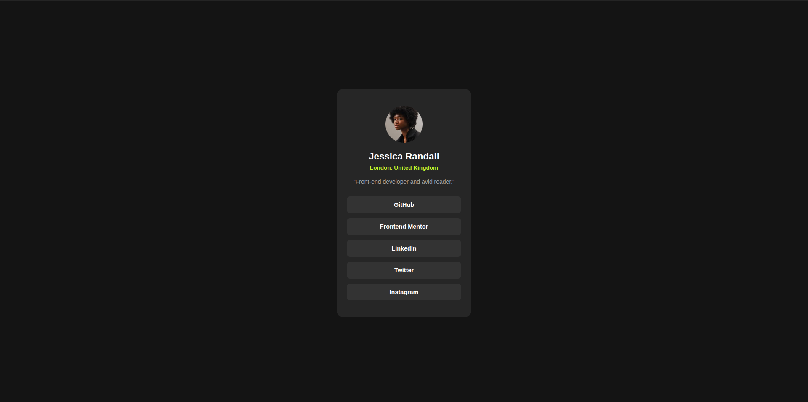

# Frontend Mentor - Social links profile solution

This is a solution to the [Social links profile challenge on Frontend Mentor](https://www.frontendmentor.io/challenges/social-links-profile-UG32l9m6dQ). Frontend Mentor challenges help you improve your coding skills by building realistic projects.

## Table of contents

- [Overview](#overview)
  - [Screenshot](#screenshot)
  - [Links](#links)
- [My process](#my-process)
  - [Built with](#built-with)
  - [What I learned](#what-i-learned)
  - [Continued development](#continued-development)
  - [Useful resources](#useful-resources)
  - [AI Collaboration](#ai-collaboration)
- [Author](#author)

---

## Overview

### Screenshot



### Links

- Solution URL: [Add solution URL here](https://github.com/TallamGilbert/Social-Links-Profile)
- Live Site URL: [Add live site URL here](https://your-live-site-url.com)

---

## My process

### Built with

- Semantic HTML5 markup
- CSS custom properties
- Flexbox
- BEM methodology

### What I learned

This challenge exposed a few BEM mistakes I had to fix. The biggest one was using `social-links` as my block name when the actual component is a profile card — the block name should reflect what the component _is_, not what it _contains_:

```css
/*  Before */
.social-links__card
.social-links__name

/*  After */
.profile-card
.profile-card__name
```

I also accidentally applied the same class to both a wrapper `<div>` and the `` inside it, which caused a conflict. The fix was to remove the unnecessary wrapper and apply the class directly to the image:

```html
<!--  Before -->
<div class="profile-card__avatar">
  
</div>

<!--  After -->

```

I also learned that links styled as buttons should look like buttons in the markup — using `display: block` and full padding rather than plain anchor styling.

### Continued development

- Getting block names right from the start before writing any markup
- Checking for duplicate class names applied to parent and child elements
- Matching design specs more closely — especially colors, which I initially got wrong on the location text and link buttons

### Useful resources

- [BEM Methodology](https://getbem.com/) - Helped me understand that block names should reflect the component, not its contents.
- [MDN: The Anchor element](https://developer.mozilla.org/en-US/docs/Web/HTML/Element/a) - Useful for understanding when to use `role="button"` on links styled as buttons.

### AI Collaboration

- **Tool used:** Claude (Anthropic)
- **How I used it:** Reviewed my HTML and CSS for BEM compliance and visual accuracy against the design.
- **What worked well:** Getting a structured breakdown of every issue — BEM, semantic, and visual — in one pass made the corrections straightforward.

---

## Author

- Frontend Mentor - [@TallamGilbert](https://www.frontendmentor.io/profile/TallamGilbert)
